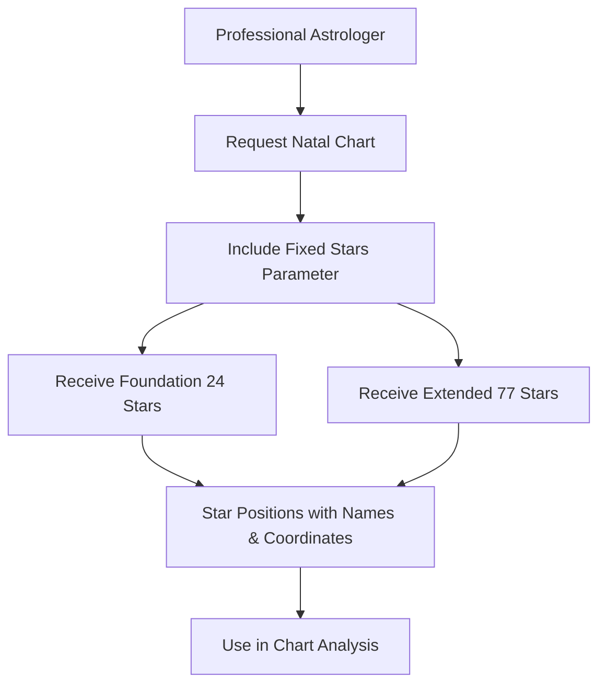
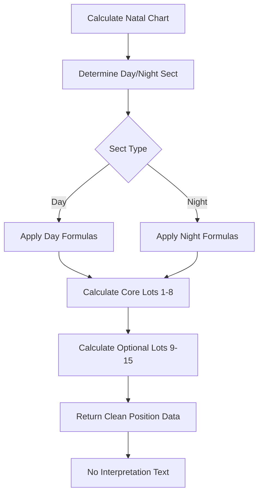
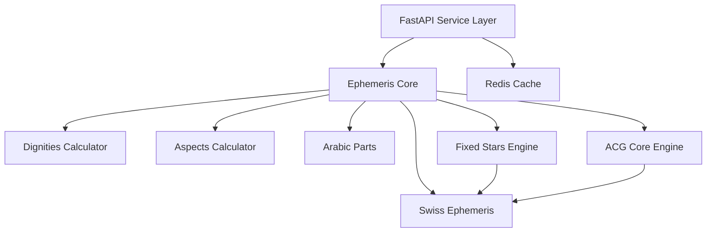
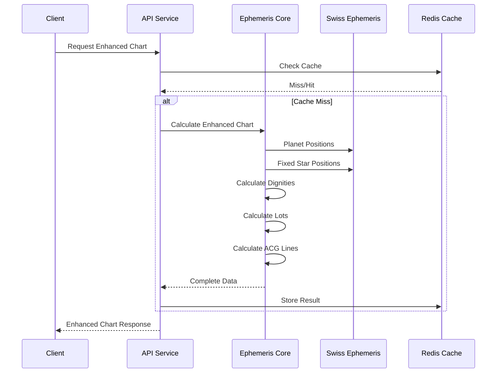

# Meridian Ephemeris API Enhancement - Product Requirements Document

## 1. Executive Summary

**Goal**: Expand the Meridian Ephemeris API to include comprehensive astrological features while maintaining performance and accuracy standards.

**Core Features to Add**:
- Fixed Stars (Foundation 24 + Extended 77 sets)
- Complete Hermetic Lots collection (15+ traditional lots)
- Astrocartography integration (positions and line calculations)
- Enhanced data quality and consistency

**Success Metrics**:
- API response time remains <100ms
- All traditional astrological calculations accurate to within 0.1°
- Complete feature parity with professional astrological software
- Zero breaking changes to existing API consumers

---

## 2. Problem & Solution

### Current State Issues
1. **Incomplete Feature Set**: Missing fixed stars, limited hermetic lots (only 2), no ACG integration
2. **Data Quality Issues**: Inconsistent precision, missing units, calculation errors in bounds/terms
3. **User Experience**: Professional astrologers need comprehensive data in single API call

### Proposed Solution
**Comprehensive Ephemeris Enhancement** that transforms the API into a complete professional astrological toolkit while maintaining existing performance and reliability standards.

---

## 3. User Stories & Requirements

### Epic 1: Fixed Stars Integration


**Story 1.1: Foundation Stars**
- **As a** professional astrologer
- **I want** access to the Foundation 24 fixed stars in natal charts
- **So that** I can perform traditional star-based interpretations

**Acceptance Criteria:**
- [ ] 24 foundation stars included with proper names
- [ ] Accurate coordinates (±0.1° precision)
- [ ] Proper magnitude and spectral data
- [ ] 100-mile influence radius metadata

**Story 1.2: Extended Star Set**
- **As an** advanced practitioner
- **I want** the complete Extended 77 star set
- **So that** I can perform comprehensive fixed star analysis

**Acceptance Criteria:**
- [ ] All 77 stars with consistent naming
- [ ] 80-mile influence radius for extended set
- [ ] Cultural significance metadata
- [ ] Performance impact <10ms additional

### Epic 2: Hermetic Lots Expansion


**Story 2.1: Complete Lot Set**
- **As a** traditional astrologer
- **I want** access to all traditional hermetic lots
- **So that** I can perform comprehensive lot-based analysis

**Acceptance Criteria:**
- [ ] 8 Core lots with day/night variations
- [ ] 7 Optional lots implemented
- [ ] Sect-appropriate formula selection
- [ ] Clean coordinate data only (no interpretations)

### Epic 3: Data Quality Enhancement
**Story 3.1: Calculation Accuracy**
- **As an** API consumer
- **I want** consistent and accurate astrological calculations
- **So that** I can trust the data for professional use

**Acceptance Criteria:**
- [ ] Egyptian bounds used consistently
- [ ] Proper Mercury term calculation (6°09′ Gem = Venus term)
- [ ] True Node motion labeling corrected
- [ ] Sect determination metadata accurate
- [ ] Consistent decimal precision (6 places for angles)

### Epic 4: Astrocartography Foundation
**Story 4.1: ACG Line Calculations**
- **As a** location-based astrologer
- **I want** access to astrocartography line calculations
- **So that** I can provide location-specific readings

**Acceptance Criteria:**
- [ ] AC/DC/MC/IC lines for all planets
- [ ] Angle aspect lines (squares, oppositions)
- [ ] Paran calculations available
- [ ] Geographic coordinate output

---

## 4. Technical Architecture

### Current System Integration


### Data Flow Enhancement


### New Components Required

**1. Fixed Stars Manager**
```python
class FixedStarsManager:
    def get_foundation_24(self, jd: float, observer: Observer) -> List[StarPosition]
    def get_extended_77(self, jd: float, observer: Observer) -> List[StarPosition]
    def calculate_star_positions(self, stars: List[str]) -> Dict[str, StarData]
```

**2. Enhanced Arabic Parts Calculator**
```python
class EnhancedArabicParts:
    def calculate_core_lots(self, chart_data: ChartData) -> Dict[str, LotPosition]
    def calculate_optional_lots(self, chart_data: ChartData) -> Dict[str, LotPosition]
    def determine_sect_formulas(self, sun_pos: float, asc: float) -> SectFormulas
```

**3. ACG Integration Layer**
```python
class ACGIntegration:
    def calculate_main_lines(self, planets: Dict, location: Location) -> ACGLines
    def calculate_angle_aspects(self, planets: Dict) -> AngleAspects
    def calculate_parans(self, planets: Dict, stars: Dict) -> ParanData
```

---

## 5. API Specifications

### Enhanced Natal Chart Endpoint
```http
POST /ephemeris/natal/enhanced
```

**Request Parameters:**
```typescript
interface EnhancedChartRequest {
  subject: SubjectData;
  configuration?: {
    house_system?: string;
    include_fixed_stars?: boolean;
    star_set?: "foundation24" | "extended77";
    include_hermetic_lots?: "core" | "extended" | "all";
    include_acg_lines?: boolean;
    precision_decimals?: number;
  };
}
```

**Response Structure:**
```typescript
interface EnhancedChartResponse {
  success: boolean;
  subject: SubjectInfo;
  planets: PlanetData[];
  houses: HouseData;
  angles: AngleData;
  aspects: AspectData[];
  
  // New sections
  fixed_stars?: {
    foundation_24?: StarPosition[];
    extended_77?: StarPosition[];
    calculation_time_ms: number;
  };
  
  hermetic_lots?: {
    core_lots: LotPosition[];
    optional_lots?: LotPosition[];
    sect_determination: SectInfo;
    calculation_time_ms: number;
  };
  
  astrocartography?: {
    main_lines: ACGLineData[];
    angle_aspects: AngleAspectData[];
    parans?: ParanData[];
    calculation_time_ms: number;
  };
}
```

---

## 6. Data Models

### Fixed Star Position
```typescript
interface StarPosition {
  name: string;
  catalog_name: string;
  longitude: number;          // degrees (6 decimal precision)
  latitude: number;           // degrees (6 decimal precision)  
  distance_ly: number;        // light years
  magnitude: number;
  spectral_class: string;
  sign_name: string;
  sign_longitude: number;     // degrees within sign
  house_number: number;
  influence_radius_miles: number; // 100 for foundation, 80 for extended
  cultural_significance: string[];
}
```

### Hermetic Lot Position
```typescript
interface LotPosition {
  name: string;
  display_name: string;
  longitude: number;          // degrees (6 decimal precision)
  sign_name: string;
  sign_degree: number;        // whole degrees
  sign_minute: number;        // arcminutes
  house_number: number;
  house_degree: number;       // degrees within house
  formula_used: string;       // e.g., "ascendant + moon - sun"
  is_day_formula: boolean;
  confidence_score: number;   // 0-1
}
```

### Data Quality Standards
- **Precision**: 6 decimal places for all longitude/latitude values
- **Units**: Explicit units for all measurements (degrees, miles, light-years)
- **Consistency**: All angle values normalized to 0-360° range
- **Validation**: Range checks and sanity tests for all calculations

---

## 7. Implementation Phases

### Phase 1: Data Quality & Bounds Fixes
**Priority**: Critical (addresses immediate feedback)
**Dependencies**: None
**Deliverables**:
- [ ] Fix Mercury bounds calculation (Egyptian vs Ptolemaic)
- [ ] Correct True Node motion labeling
- [ ] Fix sect determination metadata
- [ ] Standardize precision and units
- [ ] Add explicit bounds system declaration

### Phase 2: Fixed Stars Integration
**Priority**: High
**Dependencies**: Phase 1 complete
**Deliverables**:
- [ ] Foundation 24 star positions
- [ ] Extended 77 star set  
- [ ] Star data validation system
- [ ] Performance optimization (<10ms impact)

### Phase 3: Hermetic Lots Expansion
**Priority**: High
**Dependencies**: Phase 1 complete
**Deliverables**:
- [ ] Complete 15-lot traditional set
- [ ] Day/night sect formula switching
- [ ] Remove interpretation text
- [ ] Validate against traditional sources

### Phase 4: ACG Foundation
**Priority**: Medium
**Dependencies**: Phases 1-3 complete
**Deliverables**:
- [ ] ACG line calculation integration
- [ ] Paran calculation support
- [ ] Geographic coordinate handling
- [ ] API parameter framework

### Phase 5: Integration & Testing
**Priority**: High
**Dependencies**: All phases
**Deliverables**:
- [ ] Comprehensive integration testing
- [ ] Performance validation
- [ ] API documentation updates
- [ ] Professional astrologer validation

---

## 8. Technical Risks & Mitigations

| Risk | Impact | Probability | Mitigation |
|------|--------|-------------|------------|
| Performance degradation | High | Medium | Implement caching, batch processing, async calculations |
| Calculation accuracy | High | Low | Validate against multiple astrological references |
| Egyptian bounds implementation | Medium | High | Create comprehensive test suite with known test cases |
| Memory usage increase | Medium | Medium | Implement optional feature flags, lazy loading |
| Swiss Ephemeris compatibility | High | Low | Thorough testing with multiple SWE versions |

---

## 9. Success Metrics

### Performance Metrics
- **API Response Time**: <100ms median for enhanced charts
- **Cache Hit Rate**: >70% for repeated calculations
- **Memory Usage**: <50MB additional per request
- **Throughput**: >100 requests/second sustained

### Accuracy Metrics
- **Calculation Precision**: ±0.1° for all positions
- **Traditional Compliance**: 100% match with Lilly's dignities
- **Reference Validation**: Match against 3+ professional sources
- **Error Rate**: <0.1% calculation failures

### Feature Completeness
- **Fixed Stars**: 77 stars with accurate positions
- **Hermetic Lots**: 15 traditional lots implemented
- **ACG Foundation**: Line calculations available
- **Data Quality**: All feedback issues resolved

---

## 10. Quality Checklist

- [ ] Problem clearly articulated (incomplete astrological features)
- [ ] Solution addresses problem (comprehensive enhancement)
- [ ] All user flows diagrammed (API interactions, calculations)
- [ ] Architecture visualized (system components, data flow)
- [ ] APIs fully specified with examples (TypeScript interfaces)
- [ ] Data models included (StarPosition, LotPosition, etc.)
- [ ] Dependencies identified (Swiss Ephemeris, existing core)
- [ ] Risks identified and mitigated (performance, accuracy)
- [ ] Success metrics measurable (response time, accuracy)
- [ ] Implementation phases logical (quality → features → integration)
- [ ] Ready for implementation PRP (detailed technical specs)

---

## Immediate Action Items

Based on user feedback, the following must be addressed first:

### Critical Fixes (Phase 1)
1. **Mercury Bounds**: Switch to Egyptian bounds system, fix 6°09′ Gemini calculation
2. **True Node Motion**: Fix stationary vs direct labeling consistency  
3. **Sect Metadata**: Correct sun_above_horizon and alternative_methods fields
4. **Data Formatting**: Add units, normalize precision, fix sign position formatting

### Implementation Priority
This PRD provides the roadmap for transforming Meridian into a comprehensive professional astrological API while maintaining its performance and reliability standards.

**Next Step**: Create implementation PRP for Phase 1 critical fixes.