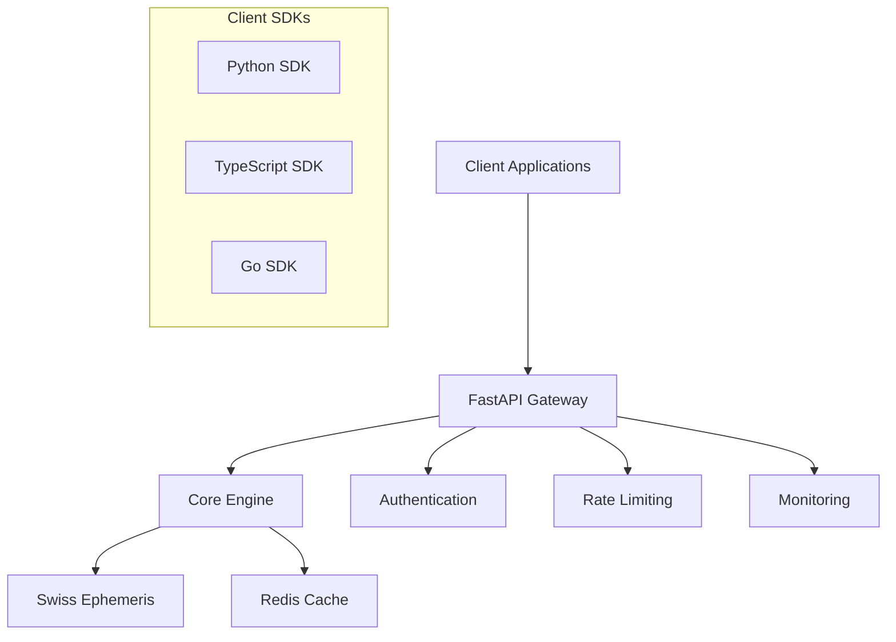

# Meridian Ephemeris API

[](https://opensource.org/licenses/MIT)
[](https://www.python.org/downloads/)
[](https://fastapi.tiangolo.com)
[](https://www.astro.com/swisseph/)

A high-precision, professional-grade astrological calculation API powered by Swiss Ephemeris. Designed for astrologers, researchers, and developers who demand accuracy and reliability.

## ✨ Features

- **🎯 High Precision**: Powered by Swiss Ephemeris for astronomical accuracy
- **🚀 Fast Performance**: Optimized calculations with intelligent caching
- **🔌 Multiple Interfaces**: REST API, Python SDK, TypeScript SDK, Go SDK
- **📚 Comprehensive Documentation**: Auto-generated docs with interactive examples
- **🏠 Multiple House Systems**: Placidus, Koch, Equal, Whole Sign, Campanus, and more
- **🌍 Global Support**: Worldwide timezone and coordinate handling
- **📊 Rich Data Models**: Complete planetary positions, houses, aspects, and angles
- **🔄 Flexible Input**: Multiple date/time and coordinate formats
- **🛡️ Production Ready**: Rate limiting, error handling, and monitoring

## 🚀 Quick Start

### Using Python SDK

```bash
pip install meridian-ephemeris
```

```python
from meridian_ephemeris import MeridianEphemeris

client = MeridianEphemeris()

chart = client.calculate_natal_chart({
    "name": "John Doe",
    "datetime": {"iso_string": "1990-06-15T14:30:00"},
    "latitude": {"decimal": 40.7128},
    "longitude": {"decimal": -74.0060},
    "timezone": {"name": "America/New_York"}
})

print(f"Sun position: {chart['data']['planets']['sun']['longitude']}°")
```

### Using REST API

```bash
curl -X POST "https://api.meridianephemeris.com/ephemeris/natal" \
  -H "Content-Type: application/json" \
  -d '{
    "subject": {
      "name": "John Doe",
      "datetime": {"iso_string": "1990-06-15T14:30:00"},
      "latitude": {"decimal": 40.7128},
      "longitude": {"decimal": -74.0060},
      "timezone": {"name": "America/New_York"}
    }
  }'
```

### Using TypeScript SDK

```bash
npm install meridian-ephemeris-sdk
```

```typescript
import { MeridianEphemeris } from 'meridian-ephemeris-sdk';

const client = new MeridianEphemeris();

const chart = await client.calculateNatalChart({
  name: "John Doe",
  datetime: { iso_string: "1990-06-15T14:30:00" },
  latitude: { decimal: 40.7128 },
  longitude: { decimal: -74.0060 },
  timezone: { name: "America/New_York" }
});
```

## 📋 System Requirements

- **Python**: 3.10 or higher
- **Node.js**: 18 or higher (for frontend/SDK development)
- **Memory**: 512MB RAM minimum, 2GB recommended
- **Storage**: 100MB for application, 500MB for full ephemeris data

## 🛠️ Installation & Setup

### Option 1: Using Docker (Recommended)

```bash
git clone https://github.com/meridian-ephemeris/api.git
cd api
docker-compose up -d
```

The API will be available at `http://localhost:8000`

### Option 2: Manual Installation

#### 1. Clone the Repository
```bash
git clone https://github.com/meridian-ephemeris/api.git
cd api
```

#### 2. Set Up Python Environment
```bash
python -m venv venv
# Windows
venv\Scripts\activate
# Linux/Mac
source venv/bin/activate
```

#### 3. Install Dependencies
```bash
pip install -r requirements.txt
```

#### 4. Download Swiss Ephemeris Data
```bash
# Download ephemeris files (automated script)
python scripts/download-ephemeris.py
```

#### 5. Start the API
```bash
uvicorn app.main:app --host 0.0.0.0 --port 8000
```

The API will be available at `http://localhost:8000`

### Option 3: Development Setup

```bash
git clone https://github.com/meridian-ephemeris/api.git
cd api

# Create virtual environment
python -m venv venv
venv/Scripts/activate  # Windows
# source venv/bin/activate  # Linux/Mac

# Install development dependencies
pip install -r requirements-dev.txt

# Install pre-commit hooks
pre-commit install

# Run tests
pytest

# Start development server with auto-reload
uvicorn app.main:app --reload --host 0.0.0.0 --port 8000
```

## 📚 Documentation

### Interactive Documentation
- **API Playground**: [https://api.meridianephemeris.com/docs](https://api.meridianephemeris.com/docs)
- **ReDoc Interface**: [https://api.meridianephemeris.com/redoc](https://api.meridianephemeris.com/redoc)

### Comprehensive Guides
- **📖 User Guide**: [docs/guides/quickstart.md](docs/guides/quickstart.md)
- **🔧 API Reference**: [docs/api/overview.md](docs/api/overview.md)
- **🐍 Python SDK**: [docs/reference/python-sdk.md](docs/reference/python-sdk.md)
- **📜 TypeScript SDK**: [docs/reference/typescript-sdk.md](docs/reference/typescript-sdk.md)
- **🏗️ Architecture**: [docs/reference/architecture.md](docs/reference/architecture.md)

### Interactive Examples
- **📓 Jupyter Notebooks**: [examples/notebooks/](examples/notebooks/)
  - [Getting Started](examples/notebooks/01-getting-started.ipynb)
  - Advanced Calculations *(Coming Soon)*
  - Batch Processing *(Coming Soon)*
  - Data Analysis *(Coming Soon)*

### Local Documentation
Build and serve documentation locally:

```bash
# Install documentation dependencies
pip install -r docs-requirements.txt

# Build documentation
python scripts/build-docs.py

# Serve locally
mkdocs serve
```

Documentation will be available at `http://localhost:8001`

## 🏗️ Architecture



### Core Components

- **FastAPI Application**: High-performance async web framework
- **Swiss Ephemeris Engine**: Astronomical calculation core
- **Redis Cache**: Intelligent response caching
- **Pydantic Models**: Type-safe data validation
- **OpenAPI Schema**: Auto-generated API documentation

### Supported Formats

**Coordinates:**
- Decimal degrees: `40.7128`
- DMS string: `40°42'46"N`
- Components: `{degrees: 40, minutes: 42, seconds: 46, direction: "N"}`

**Date & Time:**
- ISO string: `2000-01-01T12:00:00`
- Julian day: `2451545.0`
- Components: `{year: 2000, month: 1, day: 1, hour: 12, minute: 0, second: 0}`

**Timezones:**
- IANA names: `America/New_York`
- UTC offset: `-5.0`
- Auto-detection from coordinates

## 🧪 Testing

### Run Tests Locally

```bash
# Install test dependencies
pip install pytest pytest-asyncio pytest-benchmark httpx

# Run all tests
pytest

# Run with coverage
pytest --cov=app --cov-report=html

# Run performance benchmarks
pytest tests/benchmarks/
```

### Test Categories

- **Unit Tests**: Core calculation logic
- **Integration Tests**: API endpoint functionality  
- **Performance Tests**: Response time and throughput
- **Validation Tests**: Accuracy against reference data
- **End-to-End Tests**: Complete workflow scenarios

## 🚦 API Rate Limits

### Current Limits
- **Per IP**: 100 requests/minute
- **Burst**: 10 requests/second  
- **Daily**: 10,000 requests/day

### Headers
Every response includes rate limit information:
```http
X-RateLimit-Limit: 100
X-RateLimit-Remaining: 95
X-RateLimit-Reset: 1701944460
```

### Rate Limited Response (429)
```json
{
  "success": false,
  "error": "rate_limit_exceeded",
  "message": "Rate limit exceeded",
  "details": {
    "retry_after": 60
  }
}
```

## 🔧 Configuration

### Environment Variables

```bash
# API Configuration
MERIDIAN_EPHEMERIS_API_URL=https://api.meridianephemeris.com
MERIDIAN_EPHEMERIS_TIMEOUT=30

# Cache Settings
REDIS_URL=redis://localhost:6379
CACHE_TTL=3600

# Rate Limiting
RATE_LIMIT_PER_MINUTE=100
RATE_LIMIT_BURST=10

# Monitoring
ENABLE_METRICS=true
METRICS_PORT=9090
```

### Configuration File (`.meridian-ephemeris.yml`)

```yaml
api:
  base_url: "https://api.meridianephemeris.com"
  timeout: 30

cache:
  enabled: true
  ttl: 3600
  max_size: 1000

retry:
  max_retries: 3
  backoff_factor: 2.0
```

## 📊 Monitoring & Observability

### Health Endpoints
- **Global Health**: `GET /health`
- **Detailed Status**: `GET /health/detailed`
- **Ephemeris Status**: `GET /ephemeris/health`

### Metrics (Prometheus)
- Request rate and latency
- Error rates by endpoint
- Cache hit ratios
- Swiss Ephemeris calculation times

### Logging
Structured JSON logging with correlation IDs for request tracing.

## 🤝 Contributing

We welcome contributions! Please see our [Contributing Guide](CONTRIBUTING.md) for details.

### Development Workflow

1. **Fork** the repository
2. **Clone** your fork locally
3. **Create** a feature branch
4. **Make** your changes with tests
5. **Run** the test suite
6. **Submit** a pull request

### Code Quality

- **Linting**: `ruff check .`
- **Type Checking**: `mypy app/`
- **Formatting**: `ruff format .`
- **Testing**: `pytest`

## 🧾 Changelog

### v1.0.0 *(Latest)*
- ✅ Complete PRP 1-6 implementation
- ✅ Production-ready FastAPI backend
- ✅ Comprehensive documentation site  
- ✅ Auto-generated client SDKs
- ✅ Interactive Jupyter notebooks
- ✅ Full Swiss Ephemeris integration
- ✅ Multiple house system support
- ✅ Rate limiting and caching
- ✅ Monitoring and observability

## 📄 License

This project is licensed under the MIT License - see the [LICENSE](LICENSE) file for details.

## 🙏 Acknowledgments

- **Swiss Ephemeris** by Astrodienst for astronomical calculations
- **FastAPI** for the modern, fast web framework
- **Pydantic** for data validation and settings management
- **The astrological community** for feedback and requirements

## 💬 Support & Community

- **📧 Email**: [support@meridianephemeris.com](mailto:support@meridianephemeris.com)
- **🐛 Issues**: [GitHub Issues](https://github.com/meridian-ephemeris/api/issues)
- **💬 Discussions**: [GitHub Discussions](https://github.com/meridian-ephemeris/api/discussions)
- **📚 Documentation**: [https://docs.meridianephemeris.com](https://docs.meridianephemeris.com)
- **🚀 Status Page**: [https://status.meridianephemeris.com](https://status.meridianephemeris.com)

---

**Made with ❤️ for the astrological community**

*Meridian Ephemeris - Where precision meets simplicity*