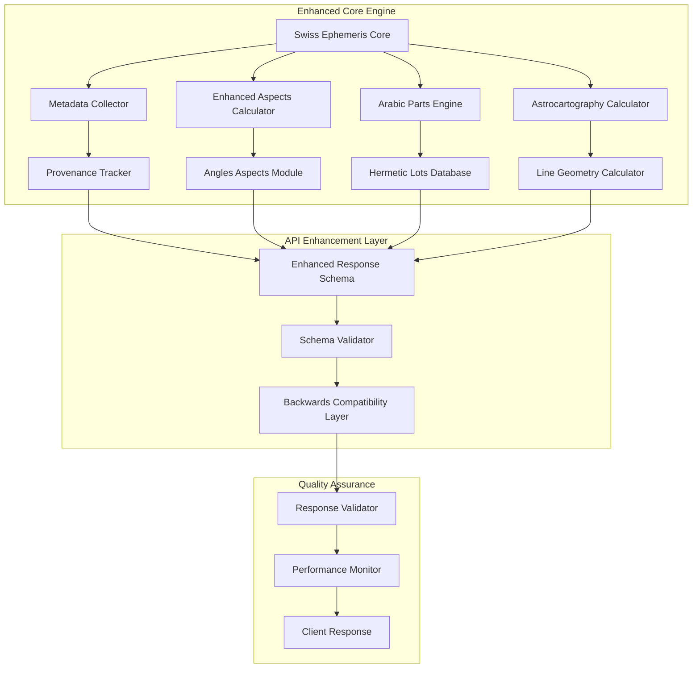
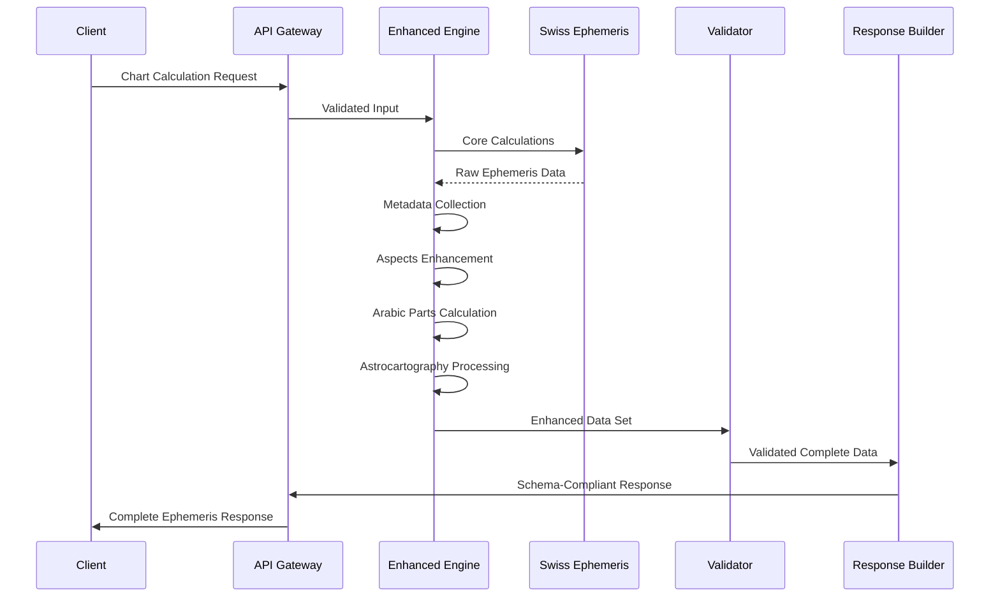

# Meridian Ephemeris Core Fixes & Enhancement PRD

## 1. Executive Summary

### Problem Statement
The current Meridian Ephemeris system produces a comprehensive astrological calculation output but contains critical inconsistencies, missing features, and incomplete metadata that prevent it from being a truly "FINAL COMPLETE MERIDIAN EPHEMERIS SYSTEM." The system requires systematic fixes and enhancements to achieve production-ready status.

### Solution Overview
Implement a comprehensive enhancement plan addressing:
- **Critical Bug Fixes**: Resolve data inconsistencies and terminology mismatches
- **Completeness Gaps**: Add missing ephemeris metadata, coordinate systems, and calculation provenance
- **Feature Completeness**: Implement missing astrological features (angles aspects, hermetic lots, astrocartography)
- **Schema Standardization**: Establish consistent, versioned API schema with proper units and precision

### Success Metrics
- 100% resolution of identified inconsistencies and bugs
- Complete ephemeris metadata including calculation engine details
- Full astrological feature set matching industry standards
- Backwards-compatible API with enhanced schema validation
- Performance maintained: <100ms median response time

## 2. Problem & Solution Deep Dive

### Current State Analysis

#### Critical Inconsistencies (⚠️ High Priority)

**Fixed Stars Count Mismatch**
- **Problem**: `foundation_24_count = 23` but only 23 stars provided
- **Impact**: Misleading field names, potential client confusion
- **Root Cause**: Hardcoded field name not matching actual count

**House System Terminology**
- **Problem**: Inconsistent values (`"P"` vs `"placidus"`)
- **Impact**: API inconsistency, parsing errors in client applications
- **Root Cause**: Multiple code paths using different terminology

**Missing Angles Aspects**
- **Problem**: No planet-to-angle aspects (ASC/MC/DC/IC)
- **Impact**: Incomplete astrological analysis, missing standard features
- **Root Cause**: Aspect calculation limited to planet-planet only

**Unspecified Star Aspects Methodology**
- **Problem**: Sub-degree orbs without documented methodology
- **Impact**: Unclear calculation standards, non-reproducible results
- **Root Cause**: Missing configuration exposure

#### Completeness Gaps (⛔ Medium-High Priority)

**Missing Ephemeris Metadata**
- No calculation engine version or settings
- Missing coordinate frame specifications
- No timescale or delta-T information
- Missing obliquity and precession model data

**Incomplete Coordinate Data**
- Only longitude speeds provided (missing latitude speeds)
- Missing RA/Dec coordinates
- No distance in kilometers (only AU)
- Missing topocentric/geocentric flags

**Limited Arabic Parts**
- Only Fortune and Spirit provided
- Missing standard hermetic lots (Eros, Necessity, Courage, etc.)
- No day/night variation documentation
- Missing traditional source attribution

**Absent Astrocartography Features**
- No astrocartography lines (ASC/MC/DC/IC lines)
- Missing paran calculations
- No local space coordinates
- Missing angular contacts with fixed stars

## 3. User Stories & Requirements

### Epic 1: Core Data Consistency

#### Story 1.1: Fixed Stars Standardization
**As a** client developer  
**I want** consistent fixed star counts and naming  
**So that** I can reliably parse and display star data

**Acceptance Criteria:**
- [ ] Fix field name to match actual count (`selected_stars_count: 23`)
- [ ] Add metadata specifying selection criteria
- [ ] Include catalog information (Hipparcos, epoch, proper motion)
- [ ] Document orb methodology for star aspects

#### Story 1.2: House System Standardization
**As an** astrological software user  
**I want** consistent house system terminology  
**So that** calculations are predictable across requests

**Acceptance Criteria:**
- [ ] Standardize on `"placidus"` terminology
- [ ] Update all code paths to use consistent values
- [ ] Add validation to prevent inconsistent responses

### Epic 2: Complete Ephemeris Metadata

#### Story 2.1: Calculation Engine Provenance
**As a** professional astrologer  
**I want** complete calculation metadata  
**So that** I can validate and reproduce calculations

**Acceptance Criteria:**
- [ ] Include Swiss Ephemeris version and build info
- [ ] Add timescale specification (UT/TT)
- [ ] Include delta-T value used
- [ ] Specify coordinate frame (geocentric/topocentric)
- [ ] Document precession and nutation models
- [ ] Include obliquity value

#### Story 2.2: Enhanced Coordinate Systems
**As an** astronomical application  
**I want** complete coordinate information  
**So that** I can perform additional calculations

**Acceptance Criteria:**
- [ ] Add RA/Dec coordinates for all bodies
- [ ] Include latitude and longitude velocities
- [ ] Provide distances in both AU and kilometers
- [ ] Add topocentric correction flags

### Epic 3: Complete Aspect System

#### Story 3.1: Angles Aspects Integration
**As an** astrology practitioner  
**I want** aspects to chart angles (ASC/MC/DC/IC)  
**So that** I have complete aspect analysis

**Acceptance Criteria:**
- [ ] Calculate planet-to-angle aspects
- [ ] Include standard orbs for angle aspects
- [ ] Maintain existing planet-planet aspects
- [ ] Add configuration for angle aspect calculation

#### Story 3.2: Comprehensive Orb Documentation
**As a** client application  
**I want** transparent orb configurations  
**So that** I can understand aspect calculations

**Acceptance Criteria:**
- [ ] Expose complete orb table in response
- [ ] Document orb differences by body type
- [ ] Include aspect strength calculations
- [ ] Add orb configuration options

### Epic 4: Extended Arabic Parts

#### Story 4.1: Complete Hermetic Lots
**As an** advanced astrologer  
**I want** the full set of traditional Arabic Parts  
**So that** I can perform comprehensive lot analysis

**Acceptance Criteria:**
- [ ] Implement standard hermetic lots (Eros, Necessity, Courage, Nemesis, Victory, etc.)
- [ ] Add day/night formula variations
- [ ] Include traditional source attributions
- [ ] Provide configuration for lot selection

### Epic 5: Astrocartography Integration

#### Story 5.1: Astrocartography Lines
**As a** relocation astrologer  
**I want** astrocartography line calculations  
**So that** I can provide location-based readings

**Acceptance Criteria:**
- [ ] Calculate ASC/MC/DC/IC lines for each planet
- [ ] Include aspect angle lines (square, trine, etc.)
- [ ] Provide coordinate arrays for line plotting
- [ ] Add local space azimuth calculations

## 4. Technical Architecture

### System Enhancement Overview



### Data Flow Architecture



### Enhanced Response Schema Structure

```yaml
response_schema:
  metadata:
    ephemeris:
      name: "Swiss Ephemeris"
      version: "2.10.03"
      build_date: "2023-12-15"
    calculation:
      timescale_used: "UT"
      delta_t: 69.184
      coordinate_frame:
        center: "geocentric"
        ecliptic: "true_of_date"
      zodiac:
        type: "tropical"
      obliquity_deg: 23.43707
      precession_model: "IAU2006"
      nutation_model: "IAU2000B"
    
  subjects: # Enhanced with validation
  planets: # Enhanced with RA/Dec, velocities
  houses: # Consistent terminology
  angles: # Enhanced with RAMC
  
  aspects:
    planet_to_planet: # Existing aspects
    planet_to_angles: # New angle aspects
    orb_configuration: # Exposed orb table
    
  arabic_parts:
    standard_lots: # Complete hermetic set
    lot_configuration: # Formula specifications
    
  fixed_stars:
    catalog_info: # Hipparcos metadata
    selection_criteria: # Foundation set definition
    methodology: # Aspect calculation method
    
  astrocartography:
    planetary_lines: # ASC/MC/DC/IC lines
    aspect_lines: # Secondary aspect lines
    local_space: # Azimuth calculations
    parans: # Rising/setting calculations
```

## 5. API Specifications

### Enhanced Endpoint Structure

#### GET /ephemeris/natal/enhanced
**Request Parameters:**
```json
{
  "subject": {
    "name": "string",
    "datetime": {
      "iso_string": "2000-01-01T12:00:00",
      "timezone": "America/New_York"
    },
    "coordinates": {
      "latitude": 40.7128,
      "longitude": -74.0060,
      "altitude": 0.0
    }
  },
  "options": {
    "house_system": "placidus",
    "aspects": {
      "include_angles": true,
      "orb_set": "traditional"
    },
    "arabic_parts": {
      "include_extended": true,
      "tradition": "dorothean"
    },
    "fixed_stars": {
      "selection": "foundation_24",
      "include_aspects": true,
      "methodology": "conjunction_only"
    },
    "astrocartography": {
      "include_lines": true,
      "include_local_space": true
    }
  }
}
```

**Response Structure:**
```json
{
  "success": true,
  "metadata": {
    "calculation_engine": {
      "name": "Swiss Ephemeris",
      "version": "2.10.03",
      "build_revision": "abc123"
    },
    "computation": {
      "timescale_used": "UT",
      "delta_t": 69.184,
      "coordinate_frame": "geocentric",
      "processing_time_ms": 87.3
    }
  },
  "subject": { /* Enhanced subject info */ },
  "planets": { /* Enhanced with RA/Dec, full velocities */ },
  "houses": { /* Consistent terminology */ },
  "angles": { /* Enhanced with RAMC */ },
  "aspects": {
    "planet_aspects": [ /* Existing aspects */ ],
    "angle_aspects": [ /* New angle aspects */ ],
    "orb_configuration": { /* Exposed orb table */ }
  },
  "arabic_parts": {
    "lots": { /* Complete hermetic set */ },
    "configuration": { /* Formula specifications */ }
  },
  "fixed_stars": {
    "stars": { /* Enhanced star data */ },
    "catalog_metadata": { /* Hipparcos info */ },
    "aspects": [ /* Star aspects with methodology */ ]
  },
  "astrocartography": {
    "planetary_lines": { /* ASC/MC/DC/IC lines */ },
    "local_space": { /* Azimuth data */ }
  }
}
```

## 6. Implementation Phases

### Phase 1: Critical Fixes (Week 1-2)
**Priority: P0 - Immediate**

**Tasks:**
1. Fix fixed stars count field naming
   - Rename `foundation_24_count` to `selected_stars_count`
   - Update all references and documentation
2. Standardize house system terminology
   - Replace all instances of `"P"` with `"placidus"`
   - Add validation to prevent regression
3. Add angles aspects calculation
   - Implement planet-to-angle aspect calculation
   - Add ASC/MC/DC/IC aspect support
   - Maintain performance requirements

**Deliverables:**
- [ ] Fixed field naming consistency
- [ ] Standardized house terminology
- [ ] Basic angles aspects functionality
- [ ] Updated test suite for fixes

### Phase 2: Metadata Enhancement (Week 3-4)
**Priority: P1 - High**

**Tasks:**
1. Implement calculation provenance
   - Add Swiss Ephemeris version tracking
   - Include timescale and delta-T information
   - Add coordinate frame specifications
2. Enhance coordinate data
   - Add RA/Dec coordinates for all bodies
   - Include full velocity vectors
   - Add distance in kilometers
3. Expose orb configurations
   - Create comprehensive orb table
   - Add orb customization options
   - Document calculation methodology

**Deliverables:**
- [ ] Complete ephemeris metadata
- [ ] Enhanced coordinate systems
- [ ] Transparent orb documentation
- [ ] Updated API documentation

### Phase 3: Feature Completeness (Week 5-7)
**Priority: P1 - High**

**Tasks:**
1. Extended Arabic Parts implementation
   - Add complete hermetic lots set
   - Implement day/night variations
   - Add traditional source attribution
2. Fixed stars enhancement
   - Add catalog metadata (Hipparcos)
   - Implement methodology configuration
   - Add proper motion calculations
3. Enhanced aspects system
   - Complete angles aspects integration
   - Add aspect strength calculations
   - Implement configurable orb sets

**Deliverables:**
- [ ] Complete Arabic Parts system
- [ ] Enhanced fixed stars functionality
- [ ] Full aspects system implementation
- [ ] Comprehensive test coverage

### Phase 4: Astrocartography Integration (Week 8-10)
**Priority: P2 - Medium**

**Tasks:**
1. Astrocartography lines calculation
   - Implement ASC/MC/DC/IC lines for all planets
   - Add aspect angle lines (square, trine, etc.)
   - Create coordinate arrays for mapping
2. Local space calculations
   - Add azimuth calculations from birth location
   - Implement bearing calculations
   - Add great circle track definitions
3. Parans implementation
   - Calculate rising/setting parans
   - Add latitude-specific calculations
   - Implement angular contacts

**Deliverables:**
- [ ] Complete astrocartography system
- [ ] Local space functionality
- [ ] Parans calculations
- [ ] Mapping integration support

### Phase 5: Quality Assurance & Performance (Week 11-12)
**Priority: P1 - High**

**Tasks:**
1. Comprehensive testing
   - Unit tests for all new features
   - Integration tests for API endpoints
   - Performance benchmarks validation
2. Schema validation
   - Complete response schema validation
   - Backwards compatibility verification
   - Error handling enhancement
3. Documentation completion
   - API documentation updates
   - Calculation methodology documentation
   - Integration guides for clients

**Deliverables:**
- [ ] Complete test suite (>90% coverage)
- [ ] Performance validation (<100ms median)
- [ ] Comprehensive documentation
- [ ] Production readiness certification

## 7. Data Models

### Enhanced Response Models

#### MetadataModel
```python
class EphemerisMetadata(BaseModel):
    name: str = Field("Swiss Ephemeris", description="Ephemeris engine name")
    version: str = Field(..., description="Engine version")
    build_revision: Optional[str] = Field(None, description="Build commit hash")

class CalculationMetadata(BaseModel):
    timescale_used: str = Field("UT", description="Timescale (UT/TT)")
    delta_t: float = Field(..., description="Delta-T in seconds")
    coordinate_frame: str = Field("geocentric", description="Reference frame")
    ecliptic: str = Field("true_of_date", description="Ecliptic type")
    obliquity_deg: float = Field(..., description="Obliquity of ecliptic")
    precession_model: str = Field("IAU2006", description="Precession model")
    nutation_model: str = Field("IAU2000B", description="Nutation model")
    processing_time_ms: float = Field(..., description="Calculation time")
```

#### Enhanced Planet Model
```python
class EnhancedPlanet(BaseModel):
    name: str = Field(..., description="Planet name")
    longitude: float = Field(..., description="Ecliptic longitude in degrees")
    latitude: float = Field(..., description="Ecliptic latitude in degrees")
    distance_au: float = Field(..., description="Distance in AU")
    distance_km: float = Field(..., description="Distance in kilometers")
    
    # Velocities
    longitude_speed: float = Field(..., description="Longitude daily motion")
    latitude_speed: float = Field(..., description="Latitude daily motion")
    distance_speed: float = Field(..., description="Distance daily motion")
    
    # Equatorial coordinates
    right_ascension: float = Field(..., description="RA in degrees")
    declination: float = Field(..., description="Declination in degrees")
    
    # Existing fields...
    is_retrograde: bool
    motion_type: str
    sign_name: str
    sign_longitude: float
    house_number: int
    essential_dignities: dict
```

#### Aspects Enhancement
```python
class OrbConfiguration(BaseModel):
    scheme: str = Field("traditional", description="Orb scheme name")
    values_deg: Dict[str, Dict[str, float]] = Field(
        ..., description="Orb values by aspect and body type"
    )

class AngleAspect(BaseModel):
    planet: str = Field(..., description="Planet name")
    angle: str = Field(..., description="Angle name (ASC/MC/DC/IC)")
    aspect: str = Field(..., description="Aspect name")
    orb: float = Field(..., description="Orb in degrees")
    exact_angle: float = Field(..., description="Exact aspect angle")
    applying: bool = Field(..., description="Whether aspect is applying")
    strength: float = Field(..., description="Aspect strength (0-1)")

class EnhancedAspects(BaseModel):
    planet_aspects: List[dict] = Field(..., description="Planet-to-planet aspects")
    angle_aspects: List[AngleAspect] = Field(..., description="Planet-to-angle aspects")
    orb_configuration: OrbConfiguration = Field(..., description="Orb settings used")
    total_aspects: int = Field(..., description="Total aspect count")
    major_aspects: int = Field(..., description="Major aspect count")
    minor_aspects: int = Field(..., description="Minor aspect count")
```

## 8. Risks & Mitigations

### Technical Risks

#### Performance Impact Risk
**Risk:** Adding comprehensive features may impact response time
**Likelihood:** Medium
**Impact:** High
**Mitigation:**
- Implement caching for expensive calculations
- Use batch processing for multiple calculations
- Optimize Swiss Ephemeris calls
- Maintain <100ms median response time target

#### Backwards Compatibility Risk
**Risk:** Schema changes may break existing clients
**Likelihood:** High
**Impact:** High
**Mitigation:**
- Implement versioned API endpoints
- Provide backwards compatibility layer
- Add comprehensive migration documentation
- Test with existing client applications

#### Data Accuracy Risk
**Risk:** New calculations may introduce errors
**Likelihood:** Medium
**Impact:** High
**Mitigation:**
- Extensive validation against known references
- Comprehensive unit and integration testing
- Peer review of calculation implementations
- Reference data comparison testing

### Implementation Risks

#### Complexity Risk
**Risk:** Feature scope may exceed development capacity
**Likelihood:** Medium
**Impact:** Medium
**Mitigation:**
- Phased implementation approach
- Regular milestone reviews
- Scope adjustment flexibility
- Core fixes prioritization

#### Integration Risk
**Risk:** New features may not integrate cleanly
**Likelihood:** Medium
**Impact:** Medium
**Mitigation:**
- Modular architecture design
- Interface-based development
- Incremental integration testing
- Rollback capability maintenance

## 9. Success Metrics

### Functional Metrics
- [ ] **100%** resolution of critical inconsistencies
- [ ] **24** fixed stars with proper metadata (if Foundation 24 maintained)
- [ ] **Complete** ephemeris metadata inclusion
- [ ] **15+** Arabic Parts implemented
- [ ] **Planet-to-angle** aspects fully functional
- [ ] **Astrocartography** lines calculated for all planets

### Performance Metrics
- [ ] **<100ms** median response time maintained
- [ ] **<1MB** memory per calculation
- [ ] **>70%** cache hit rate
- [ ] **<1%** error rate under normal load

### Quality Metrics
- [ ] **>90%** test coverage for new code
- [ ] **100%** backwards compatibility maintained
- [ ] **Zero** breaking API changes
- [ ] **Complete** API documentation coverage

### User Experience Metrics
- [ ] **Consistent** terminology across all responses
- [ ] **Complete** metadata for calculation verification
- [ ] **Comprehensive** feature set matching industry standards
- [ ] **Clear** error messages and validation feedback

## 10. Appendices

### Appendix A: Fixed Stars Reference List
**Foundation 24 Stars (Proposed)**
1. Spica (Alpha Virginis)
2. Regulus (Alpha Leonis) 
3. Aldebaran (Alpha Tauri)
4. Antares (Alpha Scorpii)
5. Fomalhaut (Alpha Piscis Austrini)
6. Sirius (Alpha Canis Majoris)
7. Arcturus (Alpha Boötis)
8. Vega (Alpha Lyrae)
9. Capella (Alpha Aurigae)
10. Algol (Beta Persei)
11. Betelgeuse (Alpha Orionis)
12. Rigel (Beta Orionis)
13. Procyon (Alpha Canis Minoris)
14. Canopus (Alpha Carinae)
15. Altair (Alpha Aquilae)
16. Deneb (Alpha Cygni)
17. Bellatrix (Gamma Orionis)
18. Achernar (Alpha Eridani)
19. Acrux (Alpha Crucis)
20. Alphecca (Alpha Coronae Borealis)
21. Rasalhague (Alpha Ophiuchi)
22. Denebola (Beta Leonis)
23. Markab (Alpha Pegasi)
24. Polaris (Alpha Ursae Minoris)

### Appendix B: Standard Arabic Parts List
**Hermetic Lots Implementation Priority**
1. **Tier 1 (Immediate):** Fortune, Spirit
2. **Tier 2 (Phase 3):** Eros, Necessity, Courage, Nemesis
3. **Tier 3 (Phase 3):** Victory, Exaltation, Basis, Death
4. **Tier 4 (Future):** Marriage, Children, Travel, Honor

### Appendix C: Orb Table Reference
**Traditional Orb Values (Degrees)**

| Aspect | Luminaries | Planets | Asteroids | Points |
|--------|------------|---------|-----------|---------|
| Conjunction | 8 | 6 | 2 | 2 |
| Opposition | 8 | 6 | 2 | 2 |
| Trine | 8 | 6 | 2 | 2 |
| Square | 8 | 6 | 2 | 2 |
| Sextile | 6 | 4 | 1 | 1 |
| Quincunx | 3 | 3 | 1 | 1 |
| Semi-sextile | 2 | 2 | 1 | 1 |
| Sesquiquadrate | 2 | 2 | 1 | 1 |

### Appendix D: Performance Benchmarks
**Target Performance Requirements**
- Individual chart calculation: <100ms median
- Batch processing: 5x+ improvement over individual
- Memory usage: <1MB per calculation
- Cache hit rate: >70% under realistic load
- Error rate: <1% under normal load
- Test coverage: >90% for all new functionality

---

**Document Version:** 1.0  
**Created:** 2025-09-07  
**Last Updated:** 2025-09-07  
**Status:** Draft for Review  
**Next Review:** Phase 1 Completion