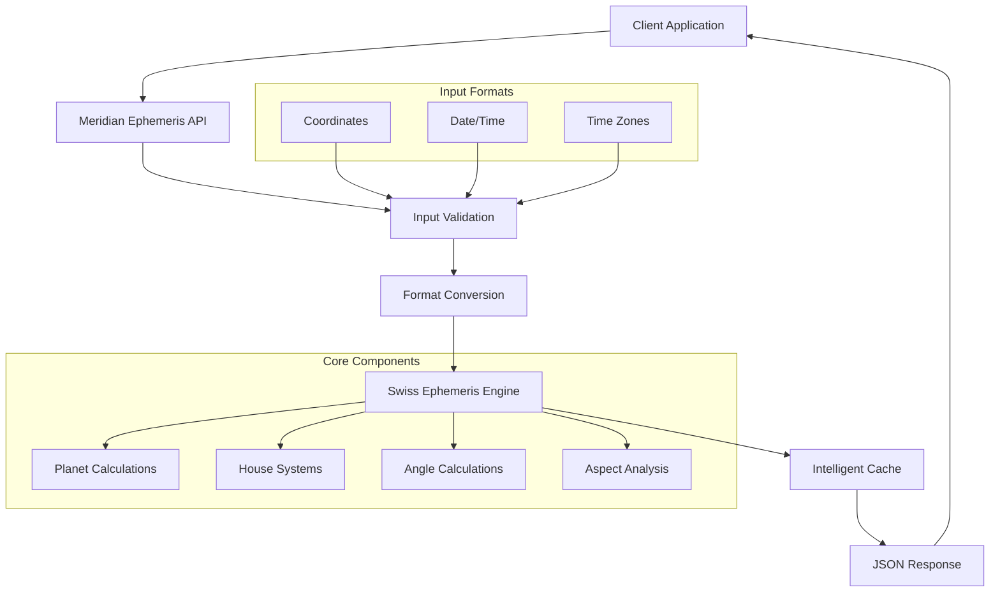

# Meridian Ephemeris API

!!! info "Professional Astrological Calculations"
    The Meridian Ephemeris API provides precise astrological chart calculations using the Swiss Ephemeris, delivering professional-grade accuracy for developers and astrologers.

## Features

- **🎯 Astronomical Precision**: Built on the Swiss Ephemeris for maximum accuracy
- **🏗️ Flexible Input Formats**: Support for multiple coordinate, datetime, and timezone formats
- **🏠 Multiple House Systems**: Placidus, Koch, Equal House, Whole Sign, and more
- **⚡ High Performance**: Parallel processing with intelligent caching
- **📊 Comprehensive Data**: Complete natal charts with planets, houses, angles, and aspects
- **🔒 Input Validation**: Robust validation with clear error messages
- **📖 Interactive Documentation**: OpenAPI specification with live testing

## Quick Start

Get started with your first chart calculation in minutes:

=== "Python"

    ```python
    import requests

    # Calculate a natal chart
    response = requests.post(
        "https://api.meridianephemeris.com/ephemeris/natal",
        json={
            "subject": {
                "name": "John Doe",
                "datetime": {"iso_string": "1990-06-15T14:30:00"},
                "latitude": {"decimal": 40.7128},
                "longitude": {"decimal": -74.0060},
                "timezone": {"name": "America/New_York"}
            }
        }
    )
    
    chart = response.json()
    print(f"Sun position: {chart['planets']['sun']['longitude']}°")
    ```

=== "TypeScript"

    ```typescript
    import { MeridianEphemerisAPI } from 'meridian-ephemeris-sdk';

    const api = new MeridianEphemerisAPI();

    const chart = await api.calculateNatalChart({
      subject: {
        name: "John Doe",
        datetime: { iso_string: "1990-06-15T14:30:00" },
        latitude: { decimal: 40.7128 },
        longitude: { decimal: -74.0060 },
        timezone: { name: "America/New_York" }
      }
    });

    console.log(`Sun position: ${chart.planets.sun.longitude}°`);
    ```

=== "cURL"

    ```bash
    curl -X POST "https://api.meridianephemeris.com/ephemeris/natal" \
      -H "Content-Type: application/json" \
      -d '{
        "subject": {
          "name": "John Doe",
          "datetime": {"iso_string": "1990-06-15T14:30:00"},
          "latitude": {"decimal": 40.7128},
          "longitude": {"decimal": -74.0060},
          "timezone": {"name": "America/New_York"}
        }
      }'
    ```

## Architecture Overview



## Supported Input Formats

### Coordinates
- **Decimal degrees**: `40.7128, -74.0060`
- **DMS strings**: `"40°42'46"N", "74°00'22"W"`
- **Component objects**: `{"degrees": 40, "minutes": 42, "seconds": 46, "direction": "N"}`

### Date & Time
- **ISO 8601 strings**: `"2000-01-01T12:00:00"`, `"2000-01-01T12:00:00-05:00"`
- **Julian Day numbers**: `2451545.0`
- **Component objects**: `{"year": 2000, "month": 1, "day": 1, "hour": 12}`

### Time Zones
- **IANA names**: `"America/New_York"`, `"Europe/London"`
- **UTC offsets**: `-5.0`, `+1.0`
- **Auto-detection**: Based on coordinates

## House Systems

The API supports multiple house systems for comprehensive astrological analysis:

| System | Code | Description |
|--------|------|-------------|
| Placidus | `placidus` | Most popular modern system |
| Koch | `koch` | Time-based system |
| Equal House | `equal` | Simple 30° divisions |
| Whole Sign | `whole_sign` | Ancient system using whole zodiac signs |
| Campanus | `campanus` | Spatial system |
| Regiomontanus | `regiomontanus` | Medieval system |

## Response Data Structure

Every natal chart calculation returns comprehensive astrological data:

```json
{
  "success": true,
  "data": {
    "subject": { /* Subject information */ },
    "planets": {
      "sun": { "longitude": 95.123, "latitude": 0.001, /* ... */ },
      "moon": { "longitude": 180.456, "latitude": -2.345, /* ... */ }
      /* ... all planets */
    },
    "houses": {
      "system": "placidus",
      "cusps": [0.0, 30.0, 60.0, /* ... 12 house cusps */],
      "angles": {
        "ascendant": 15.123,
        "midheaven": 105.456,
        "descendant": 195.123,
        "imum_coeli": 285.456
      }
    },
    "aspects": [ /* Planetary aspects */ ],
    "calculation_time": "2023-12-07T10:30:00Z",
    "julian_day": 2460288.9375
  }
}
```

## Next Steps

- 📚 **[Quick Start Guide](guides/quickstart.md)**: Step-by-step setup and first calculation
- 🔧 **[API Reference](api/overview.md)**: Complete endpoint documentation
- 📖 **[Tutorials](tutorials/basic-charts.md)**: Learn with practical examples
- 💻 **[Client SDKs](reference/python-sdk.md)**: Language-specific libraries
- 📓 **[Jupyter Notebooks](examples/notebooks.md)**: Interactive examples

## Support

Need help? We're here to assist:

- 📧 **Email**: [support@meridianephemeris.com](mailto:support@meridianephemeris.com)
- 🐛 **Issues**: [GitHub Issues](https://github.com/meridian-ephemeris/api/issues)
- 💬 **Discussions**: [GitHub Discussions](https://github.com/meridian-ephemeris/api/discussions)
- 📖 **Documentation**: This comprehensive guide

---

*Built with ❤️ using the Swiss Ephemeris and FastAPI*