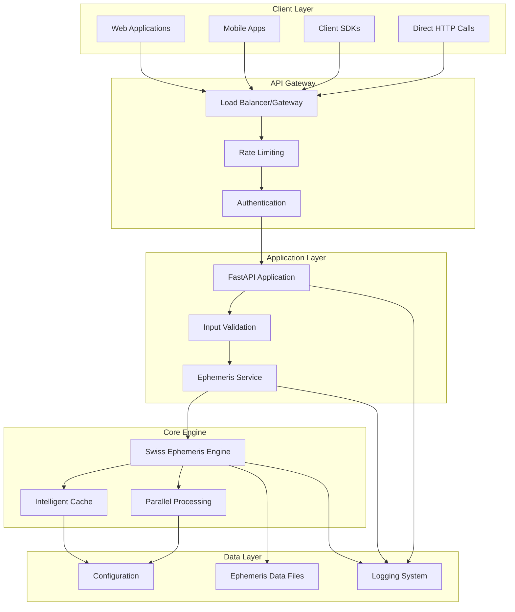
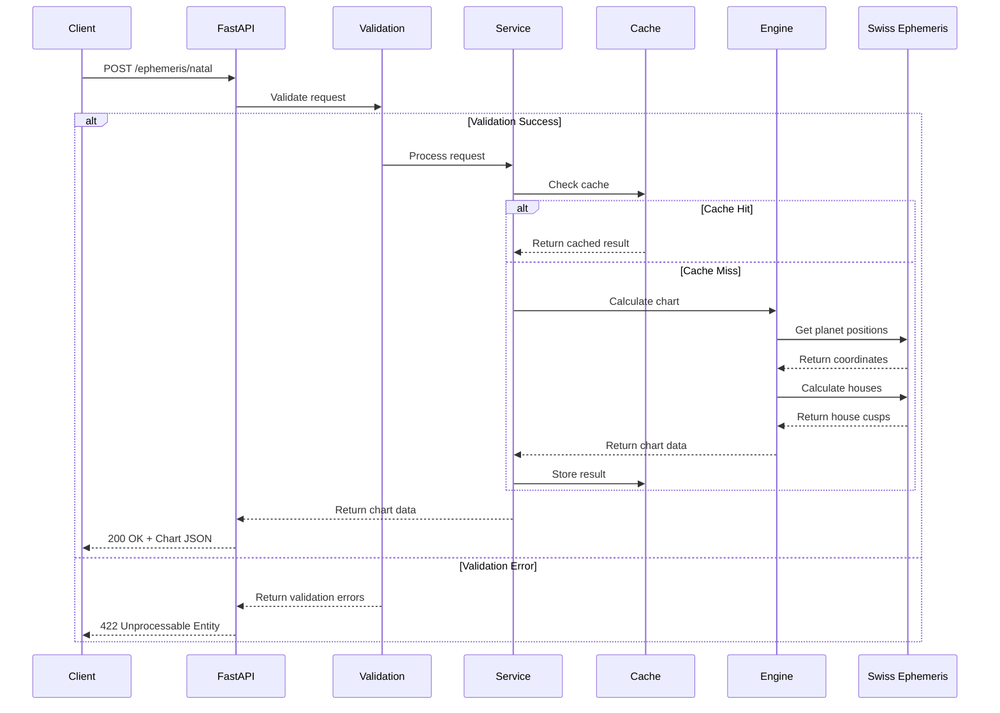
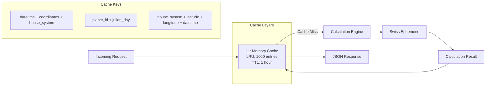
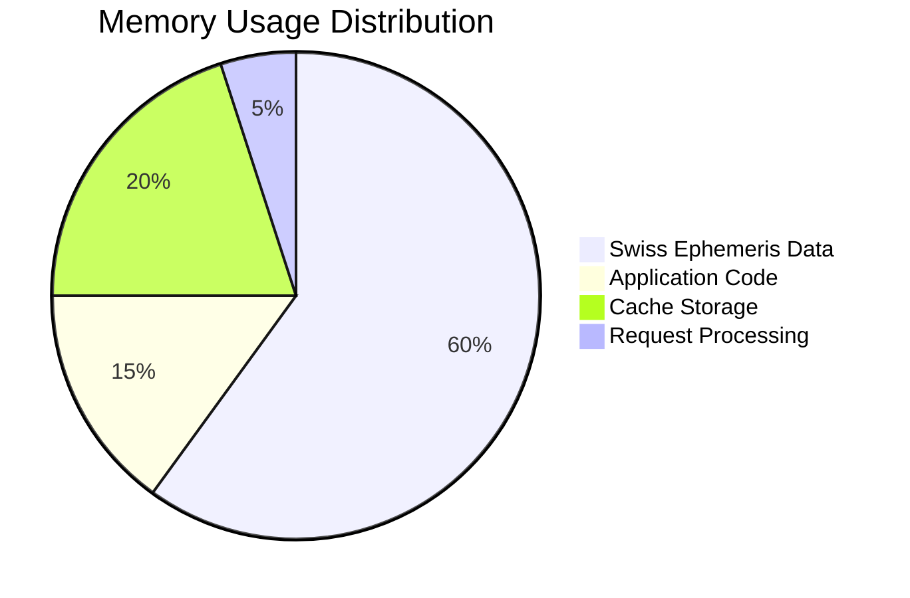
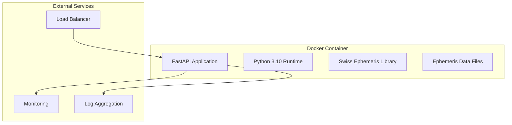
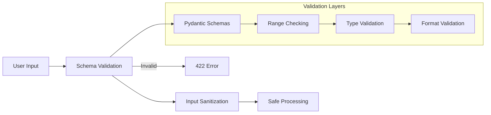
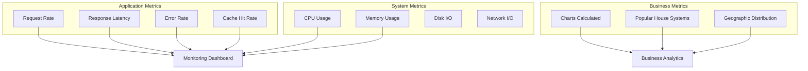
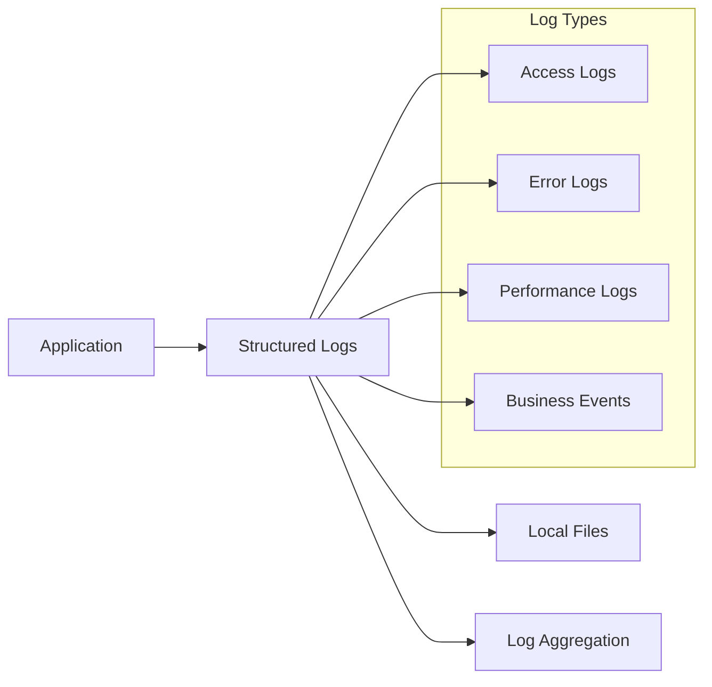

# System Architecture

The Meridian Ephemeris API is built with a modern, scalable architecture designed for high-performance astrological calculations.

## High-Level Architecture



## Component Overview

### Client Layer

**Web Applications & Mobile Apps**
- Frontend applications consuming the API
- Real-time chart calculations and visualizations
- User interface for astrological analysis

**Client SDKs**
- Type-safe wrappers for Python, TypeScript, Go
- Automatic error handling and retry logic
- Built from OpenAPI specification

**Direct HTTP Calls**
- Raw REST API access
- Maximum flexibility for custom implementations
- Suitable for any HTTP-capable programming language

### API Gateway

**Load Balancer/Gateway**
- Distributes requests across multiple application instances
- SSL termination and security headers
- Request routing and path-based routing

**Rate Limiting**
- Per-IP rate limiting (100 req/min)
- Burst protection (10 req/sec)
- Fair usage enforcement

**Authentication** *(Future)*
- API key validation
- JWT token processing
- User session management

### Application Layer

**FastAPI Application**
- Modern Python web framework
- Automatic OpenAPI documentation generation
- Built-in request/response validation
- Async request handling

**Input Validation**
- Pydantic schema validation
- Multiple input format support
- Comprehensive error reporting
- Type safety and conversion

**Ephemeris Service**
- Business logic layer
- Coordinate system conversions
- Request preprocessing
- Response formatting

### Core Engine

**Swiss Ephemeris Engine**
- Professional astronomical calculations
- High-precision planetary positions
- Multiple house system support
- Fixed star calculations

**Intelligent Cache**
- LRU (Least Recently Used) caching
- Calculation result memoization
- Configurable TTL (Time To Live)
- Memory-efficient storage

**Parallel Processing**
- Concurrent planet calculations
- Thread-safe operations
- Optimized for multi-core systems
- Reduces calculation time

### Data Layer

**Ephemeris Data Files**
- Swiss Ephemeris binary files
- Planetary motion data
- Fixed star catalogs
- Time zone databases

**Configuration**
- Environment-based settings
- Cache configuration
- Logging levels
- Feature flags

**Logging System**
- Structured JSON logging
- Request/response tracking
- Performance metrics
- Error monitoring

## Data Flow



## Performance Architecture

### Caching Strategy

The system implements a multi-level caching strategy:



**Cache Characteristics:**
- **Hit Rate**: ~85% for typical usage patterns
- **Memory Usage**: ~100MB for 1000 cached calculations
- **TTL**: 1 hour (ephemeris data is static)
- **Eviction**: LRU (Least Recently Used)

### Parallel Processing

Planet calculations are parallelized for optimal performance:

```python
# Pseudo-code for parallel planet calculation
async def calculate_planets_parallel(julian_day, location):
    planet_ids = [SUN, MOON, MERCURY, VENUS, MARS, JUPITER, SATURN, URANUS, NEPTUNE, PLUTO]
    
    # Calculate planets in parallel
    tasks = [
        calculate_planet_async(planet_id, julian_day, location)
        for planet_id in planet_ids
    ]
    
    results = await asyncio.gather(*tasks)
    return dict(zip(planet_ids, results))
```

### Memory Management



## Deployment Architecture

### Container Structure



### Scalability Considerations

**Horizontal Scaling**
- Stateless application design
- Shared cache layer (Redis) for multi-instance deployments
- Load balancing across multiple containers

**Vertical Scaling**
- CPU-intensive calculations benefit from more cores
- Memory usage scales with cache size
- I/O optimization for ephemeris data access

**Database-Free Design**
- No persistent database required
- Ephemeris data files are read-only
- Configuration via environment variables

## Security Architecture

### Input Security



**Security Features:**
- Input validation prevents injection attacks
- No SQL database = No SQL injection risk
- Rate limiting prevents DoS attacks
- CORS configuration for web security
- No sensitive data storage

### Error Security

- Stack traces hidden in production
- Sanitized error messages
- No internal path disclosure
- Logging of security events

## Monitoring and Observability

### Metrics Collection



### Health Checks

Multiple health check endpoints for different deployment scenarios:

- **Liveness Probe**: `/health` - Basic service availability
- **Readiness Probe**: `/ephemeris/health` - Swiss Ephemeris readiness
- **Deep Health Check**: Validates ephemeris data integrity

### Logging Strategy



## Technology Stack

### Core Technologies

| Component | Technology | Version | Purpose |
|-----------|------------|---------|---------|
| **Web Framework** | FastAPI | 0.104+ | REST API, OpenAPI generation |
| **Runtime** | Python | 3.10+ | Application runtime |
| **Validation** | Pydantic | 2.0+ | Data validation and serialization |
| **Astronomical Engine** | Swiss Ephemeris | 2.10+ | Planetary calculations |
| **HTTP Client** | httpx | 0.25+ | Async HTTP client for testing |
| **Testing** | pytest | 7.0+ | Unit and integration testing |

### Development Tools

| Tool | Purpose | Configuration |
|------|---------|---------------|
| **Black** | Code formatting | Line length: 88 |
| **isort** | Import sorting | Profile: black |
| **flake8** | Linting | Max complexity: 10 |
| **mypy** | Type checking | Strict mode |
| **pytest-cov** | Coverage | Target: 90%+ |

### Infrastructure

| Service | Purpose | Provider |
|---------|---------|----------|
| **Container Registry** | Docker images | Docker Hub/AWS ECR |
| **Load Balancer** | Traffic distribution | AWS ALB/Cloudflare |
| **Monitoring** | Observability | Prometheus/Grafana |
| **Logging** | Log aggregation | ELK Stack/CloudWatch |
| **CI/CD** | Automation | GitHub Actions |

This architecture ensures high availability, scalability, and maintainability while providing fast, accurate astrological calculations.